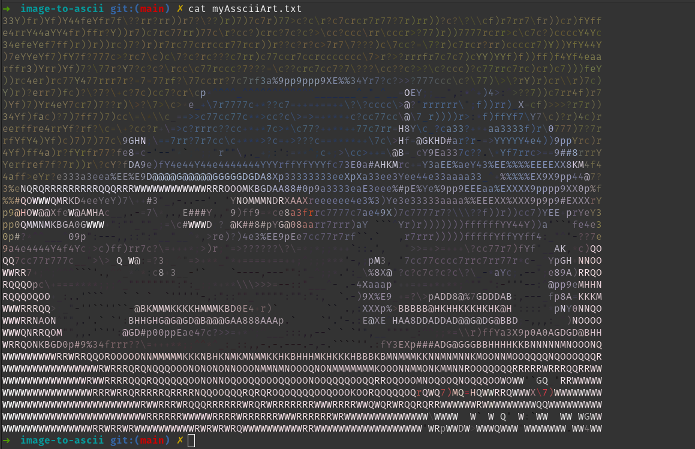
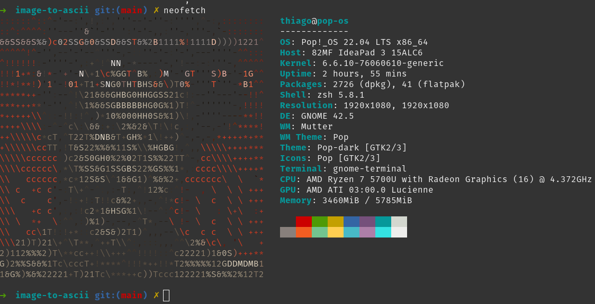
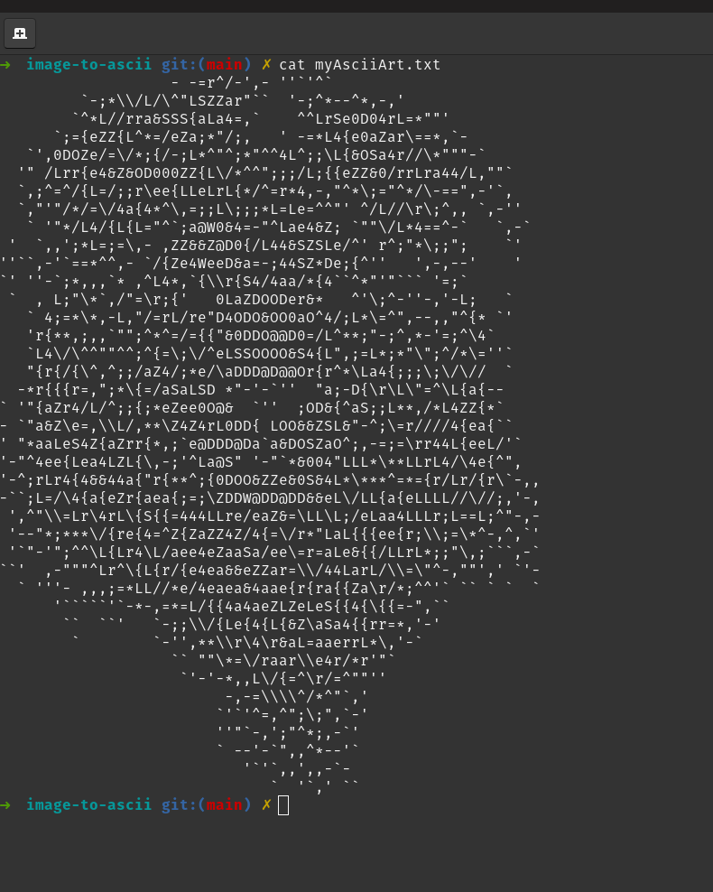
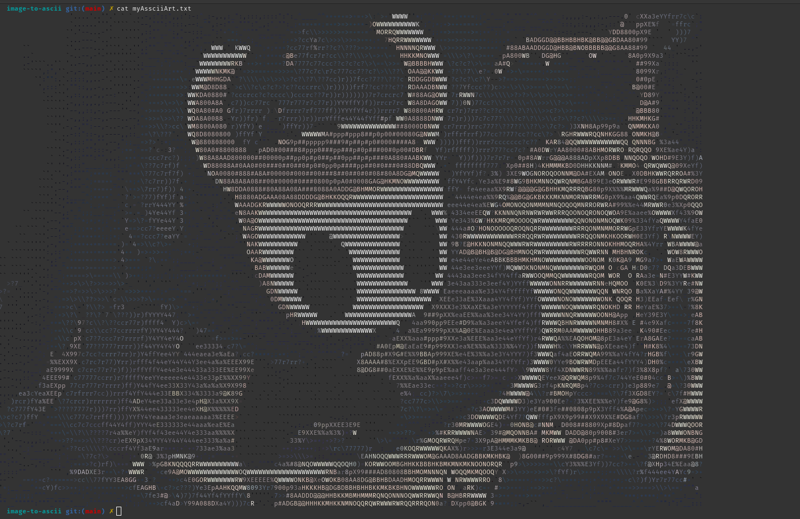

# image-to-ascii

image-to-ascii is a java image to ascii art parser, as the name implies, it generates an ASCII art from any image.<br>
It is highly configurable but at the same time easy to use.

## Results

<div>








</div>
<br>

# Download

Gradle:

```gradle

dependencies {
  implementation ("io.github.seujorgenochurras:image-to-ascii:0.0.2")
}

```

Maven:

```xml

<dependency>
  <groupId>io.github.seujorgenochurras</groupId>
  <artifactId>image-to-ascii</artifactId>
  <version>0.0.2</version>
</dependency>

```

[JPM](https://github.com/seujorgenochurras/Jhey-Package-Manager):

  ⚠️ NOT RECOMMENDED ⚠️ [JPM](https://github.com/seujorgenochurras/Jhey-Package-Manager) has a hole lots of bugs 
  and it'll probably cause you to have a massive headache.<br>
  This is here because I worked hard (and badly) on it, 
  if you liked the idea please let me know.
    
  `jpm -i=io.github.seujorgenochurras.image-to-ascii`  

# Usage

Since the parser is highly configurabe it might be really annoying to use it.
So if you are in a hurry or you just don't want to read the code you can use the `DefaultParserConfig`.

```java

        String imagePath = "smth/somewhere/yourImageFilePath";

        String imageAsciiArt = DefaultAsciifier.toAscii(imagePath, height, width, withAnsiColor);

        FileWriter fileWriter = new FileWriter("myAsciiArt.txt");
        fileWriter.write(imageAsciiArt);
        fileWriter.flush();

```
<br>

## Configurations 

If you want to configure more stuff such as the core algorithms, you can do it with the `ParserConfig` : <br>
  
  ```java

    String[] symbols = {" ", ".", "-", "I", "W", "@"};

    ParserConfig parserConfig = ParserBuilder.startBuild()
            .parserAlgorithm(Algorithms.HUMAN_EYE_ALGORITHM)
            .scaled()
              .height(30)
              .width(80)
            .getScale()
            .symbols(symbols)
            .withColor(new AnsiColorAlgorithm())
            .build();

    String asciiArt = AsciiParser.parse(imagePath, parserConfig);

```

  As you can see, there're lots of different configurations for your ASCII art, I'll list some of the most important stuff here:<br>
  - parserAlgorithm
      - This is the algorithm that defines how to deal with brightness, basically speaking the HUMAN_EYE_ALGORITHM is the best for humans
  - scaled
    - This is where you define if you want to scale down (or up) your image
  - symbols
    - Symbols to use in the ASCII art from darkest to brightest, you can use `symbolPatternFinder` to automatically generate symbols in ""perfect"" order

       ```java
       
        String[] unorderedSymbols = StringUtils.getUTFChars(32, 132);
        String[] symbols = BestSymbolPatternFinder.findBestPattern(totalSymbols, unorderedSymbols).toArray();
       
      ```
  
  - withColor
    - This is the color algorithm, yes you read it right, we have colors.<br>
      More specifically ANSI colors, if you have no idea what ANSI is,
      it is basically a standard on most of terminals that allows you to make some pretty awesome stuff, like playing videos with characters on your terminal or       even colorize them.<br>
      for now there are only 2 colored algorithms, the normal ANSI and the ANSI with tones

